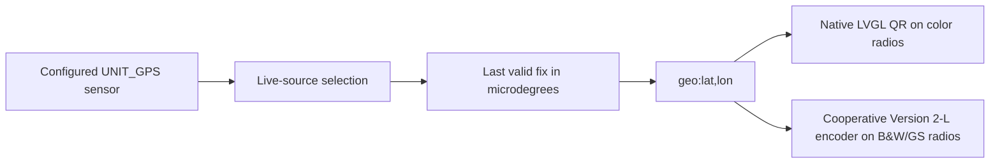

# EdgeTX GPS QR Code

[](https://github.com/EdgarAllenPoe/edgetx-gps-qrcode/actions/workflows/ci.yml)
[](https://github.com/EdgarAllenPoe/edgetx-gps-qrcode/releases/latest)


This application was 100% vibe-coded using chat GPT 5.5 Pro. there has been no manual review of the code.

Universal EdgeTX scripts that turn the active model's last valid GPS telemetry position into a scannable `geo:` QR code.

A single SD-card package supports:

- **Color radios** through `/WIDGETS/GPSQR/main.lua`.
- **Black-and-white and grayscale radios** through `/SCRIPTS/TELEMETRY/GPSQR.lua`.
- Renamed or multiple GPS sensors through `UNIT_GPS` discovery.
- Landscape, portrait, compact, touch, and key-only color layouts.
- Cooperative QR generation on monochrome radios.

The color widget has been physically validated on a **RadioMaster TX16S**. One-bit, grayscale, portrait, wide-color, renamed-sensor, and polarity cases are covered by host-side tests; representative hardware validation is still encouraged for other radios.

## Quick installation

Download the recommended archive from the [latest GitHub Release](https://github.com/EdgarAllenPoe/edgetx-gps-qrcode/releases/latest):

```text
GPSQR-v10.10.7-SD-minified.zip
```

The release also includes:

```text
GPSQR-v10.10.7-SD-readable.zip
SHA256SUMS
```

The minified archive is recommended for normal radio use. The readable archive contains the same functionality with full inline documentation for inspection and customization.

Extract the chosen archive directly to the root of the radio SD card. The result must contain:

```text
/WIDGETS/GPSQR/main.lua
/SCRIPTS/TELEMETRY/GPSQR.lua
```

Delete stale compiled files if present:

```text
/WIDGETS/GPSQR/main.luac
/SCRIPTS/TELEMETRY/GPSQR.luac
```

Restart the radio completely.

- On a color radio, add **GPS QR** to a Main View.
- On a monochrome or grayscale radio, assign `GPSQR` to a telemetry screen.

A repository checkout also contains the same prebuilt archives under `dist/`.

See [Installation](docs/INSTALLATION.md) for complete instructions.

## GPS preparation

The active model must have a configured telemetry sensor whose unit is **GPS Coordinates**. Use **Discover New** in the model Telemetry page while the receiver, flight controller, and GPS telemetry link are active.

The sensor does not have to be named `GPS`; the scripts enumerate configured sensors and identify coordinates by `UNIT_GPS`.

## Repository layout

```text
src/
  color/main.lua                 Fully documented color widget
  monochrome/GPSQR.lua           Fully documented B&W/grayscale telemetry script

dist/
  readable/                      Exact SD layout using documented source
  minified/                      Exact SD layout optimized for radios
  GPSQR-...-SD-readable.zip      Readable installation archive
  GPSQR-...-SD-minified.zip      Recommended installation archive
tests/                           Lua harnesses and independent QR decode tests
tools/                           Build, packaging, and repository checks
docs/                            User, architecture, compatibility, and maintainer docs
```

## Build and test

```bash
npm ci
python3 -m pip install -r requirements-dev.txt
npm run build
npm test
npm run verify
npm run package
```

Or run the complete release pipeline:

```bash
make release
```

See [Development](docs/DEVELOPMENT.md) and [Testing](docs/TESTING.md).

## Continuous integration and releases

The `verify` GitHub Actions workflow runs on pushes and pull requests. It installs the public npm and Python dependencies, builds both distributions, runs the host and QR-decode tests, checks repository invariants, rebuilds the release archives, and verifies that committed files under `dist/` are current.

Versioned GitHub Releases provide the minified and readable SD-card archives plus `SHA256SUMS`. The repository currently uses `master` as its default branch because it is maintained as a fork of the original project.

## Runtime architecture



The two entry points intentionally share behavior but not runtime code loading. The color widget is self-contained to avoid widget-discovery and cross-directory loader failures. The monochrome script is self-contained because those radios use telemetry scripts rather than widgets.

## Safety

Generating a QR code in Lua is CPU-intensive on lower-power radios. The monochrome implementation splits work across background callbacks and keeps the previous completed QR visible, but radio and firmware performance still vary. Do not leave the QR telemetry screen open during flight until it has been validated on the specific transmitter.

The displayed location is sensitive information. Screenshots and photos of the QR code disclose the encoded coordinates.

## Documentation

- [Installation](docs/INSTALLATION.md)
- [User guide](docs/USER_GUIDE.md)
- [Compatibility](docs/COMPATIBILITY.md)
- [Troubleshooting](docs/TROUBLESHOOTING.md)
- [Architecture](docs/ARCHITECTURE.md)
- [Sensor discovery](docs/SENSOR_DISCOVERY.md)
- [Development](docs/DEVELOPMENT.md)
- [Testing](docs/TESTING.md)
- [Release process](docs/RELEASE_PROCESS.md)
- [GitHub setup](docs/GITHUB_SETUP.md)
- [Changelog](CHANGELOG.md)

## License

BSD 3-Clause. See [`LICENSE`](LICENSE) and [`THIRD_PARTY_NOTICES.md`](THIRD_PARTY_NOTICES.md).
