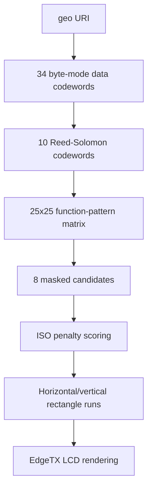

# Architecture

## Two native EdgeTX entry points

EdgeTX uses different extension models for its displays:

```text
Color radio                         B&W / grayscale radio
-----------                         ---------------------
/WIDGETS/GPSQR/main.lua             /SCRIPTS/TELEMETRY/GPSQR.lua
Widget callbacks                    Telemetry callbacks
Native LVGL QR                      Embedded QR encoder
```

The project ships both files rather than trying to load one display backend dynamically. This keeps widget registration lightweight and avoids cross-directory module-loader failures.

## Shared behavioral model

Although the files are self-contained, they implement the same state transitions:

```mermaid
stateDiagram-v2
    [*] --> Discovering
    Discovering --> Waiting: GPS sensor configured
    Discovering --> Missing: no UNIT_GPS sensor
    Waiting --> Fixed: valid coordinates
    Fixed --> Pending: position changes
    Pending --> Fixed: QR committed
    Fixed --> Fixed: telemetry loss; retain last fix
```



Both store coordinates as integer microdegrees and construct:

```text
geo:0,0?q=<latitude>,<longitude>
```

## Color widget

The color widget delegates QR encoding and rendering to EdgeTX's `lvgl.qrcode` object.

### Callback responsibilities

- `create()` initializes state and builds the first LVGL tree.
- `update()` handles options or zone changes.
- `background()` samples GPS with minimal work.
- `refresh()` processes input and rebuilds only when geometry or committed payload changes.

### Layout

- Landscape zones place the QR beside the information panel.
- Portrait zones place the QR above the information panel.
- Small embedded zones display guidance instead of an unreliable small QR.
- Full-screen mode adds a refresh control when supported.

All LVGL coordinates are local to the widget zone.

## Monochrome and grayscale telemetry script

The telemetry script contains a specialized QR Version 2-L encoder.

### Data path



### Packed matrix

A Version 2 QR is 25 modules wide, so each row fits in one 32-bit integer. Two row arrays store:

- Dark modules.
- Reserved function-pattern modules.

This is far smaller than nested Lua tables containing one number per module.

### Cooperative state machine

QR work is broken into stages and advanced by `background()`:

1. Encode data codewords.
2. Process Reed-Solomon codewords in bounded batches.
3. Build the base matrix.
4. Place and score one or more masks.
5. Build cached render runs.
6. Validate and commit the completed QR.

The previous QR remains the active display buffer until the new job reaches the ready state.

### Renderer

Horizontal and vertical run lists are both evaluated. The shorter list is retained, reducing `lcd.drawFilledRectangle()` calls on every foreground frame.

## Error handling

- Telemetry reads use protected calls where API availability can vary.
- Invalid coordinates are ignored without erasing the last fix.
- Color LVGL build failures are converted to visible in-zone error text.
- Monochrome generation errors are retained in state and displayed instead of a partial QR.

## Test interface

The monochrome source exposes `_test` helpers only when `GPS_QR_TEST_MODE` is defined by a host harness. Normal radio execution does not define that global.
